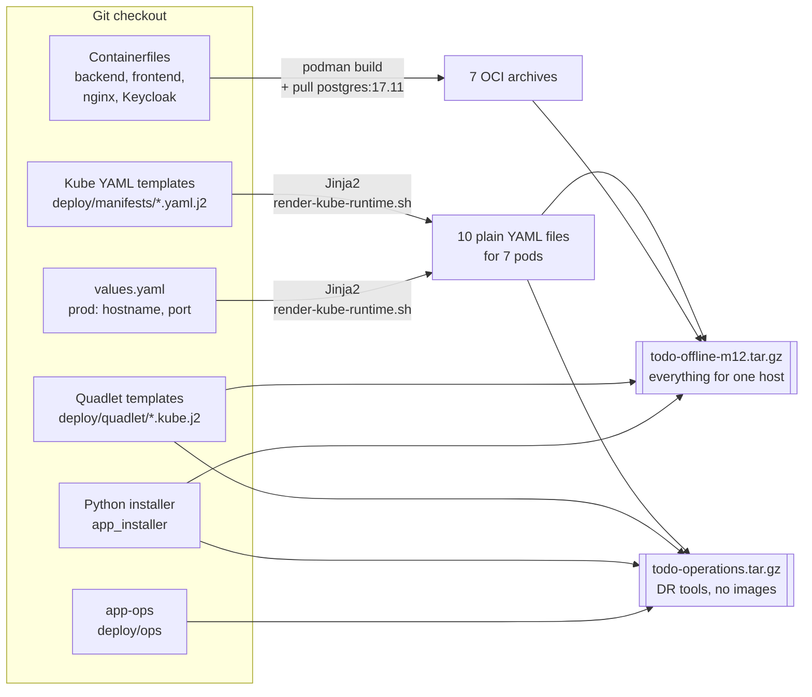
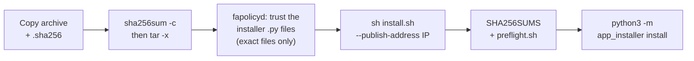
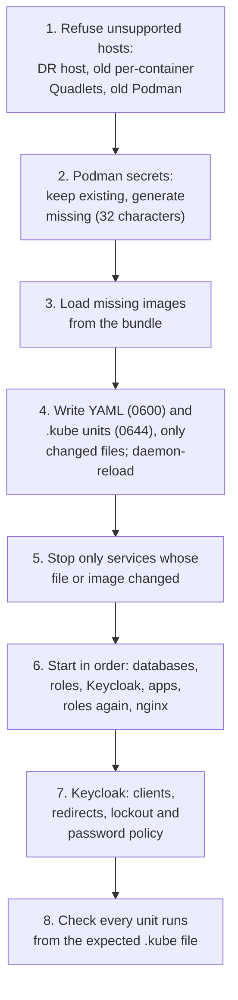

# Install picture: from source to running pods

One page showing how the solution is built, packed, moved and installed today.
[TARGET-PICTURE.md](TARGET-PICTURE.md) is the matching page for DR.

## Build on a connected machine

Both packages get a `VERSION` file (Git revision and `clean`/`dirty`), a
`SHA256SUMS` file for every file inside, and an external `.sha256` next to the
archive. Build only from a clean checkout; `dirty` is for diagnosis.

## Move and install on the target (no internet)

`preflight.sh` changes nothing. It checks Podman rootless, subuid/subgid, the
Quadlet generator, `systemctl --user`, Python with Jinja2, free ports
5432-5434, 8080 and 8443, and reports disk and memory.

## What the Python installer does

Run it again with the same arguments and nothing changes (`changed: false`).
The installer never asks for a password and never changes firewalld.

## What ends up on the host

| Where | What |
|---|---|
| `~/.config/containers/systemd/` | `app-network.network` and the `todo-kube-runtime/` folder |
| `…/todo-kube-runtime/*.yaml` | The rendered pods and ConfigMaps, as built (0600) |
| `…/todo-kube-runtime/*.kube` | Seven Quadlet units; user systemd starts them at boot |
| `podman secret ls` | Database, migrator, app and Keycloak admin passwords; never in YAML or the bundle |
| Podman volumes | Three database volumes and `todo-nginx-data` (TLS key and certificate) |
| Ports | 8443 on the chosen IP; 8080 and 5432-5434 on localhost only |

## Same YAML, three ways to run it

| | Development | One production host | Two hosts (DR) |
|---|---|---|---|
| Command | `dev-up.sh` / `dev-down.sh` | `sh install.sh` | `app-ops` from the client |
| Runs pods with | `podman kube play` directly | Quadlet `.kube` units | Quadlet `.kube` units |
| Images | Built from the checkout | Loaded from the bundle | Loaded from the bundle |
| YAML | Rendered with `local` values | Rendered at build, `prod` values | The same as one host |
| Code that installs | `app_installer` | `app_installer` | `app_installer` on each host, over SSH |

One implementation: app-ops installs nothing itself. It calls the same
`app_installer` CLI on each host, then adds replication, promotion and backup.
