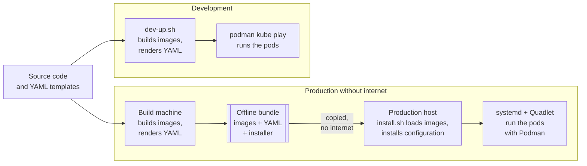

# Install picture: from source to running pods

How the application gets from source code to running pods, in production and
in development. [TARGET-PICTURE.md](TARGET-PICTURE.md) is the matching page
for failover between two sites.

**The same application and the same YAML templates in both. Only how it is
started and kept running differs. The production install needs no internet.**

## Production without internet

1. **Build.** On a suitable build machine: build the container images from
   the source code, fetch the base images they need, and render the YAML
   from the templates.
2. **Pack.** Put the container images, the rendered YAML and the install
   tools into one offline bundle.
3. **Move.** Copy the bundle to a prepared production host without internet
   access.
4. **Install.** `install.sh` loads the images and installs the configuration.
5. **Run.** systemd starts and restarts the pods through Quadlet, which runs
   them with Podman.

The build machine does not have to be a particular server or CI system. It
needs access to the source code, the container images and the other build
dependencies, over the internet, from internal mirrors or from local storage.

**Prerequisite:** the production host must already be prepared with the host
tools it needs, among them Podman, systemd and Python with Jinja2.

## Development

1. The developer uses the same source code and YAML templates.
2. `dev-up.sh` builds the images, renders the YAML and starts the application
   with `podman kube play`.
3. This path uses neither systemd nor Quadlet. `dev-down.sh` stops it.

## More detail

- [Offline bundle](../deploy/offline/README.md): building, checking and
  installing the bundle, and the host prerequisites.
- [Python installer](../deploy/installer/README.md): what `install.sh` and
  `dev-up.sh` do, step by step.
- [Architecture](ARCHITECTURE.md): the seven pods and why they are grouped
  as they are.
- [Secrets](SECRETS.md) and [TLS](TLS.md): passwords and certificates.
- [app-ops](../deploy/ops/README.md): the second site, replication, failover
  and backup.
