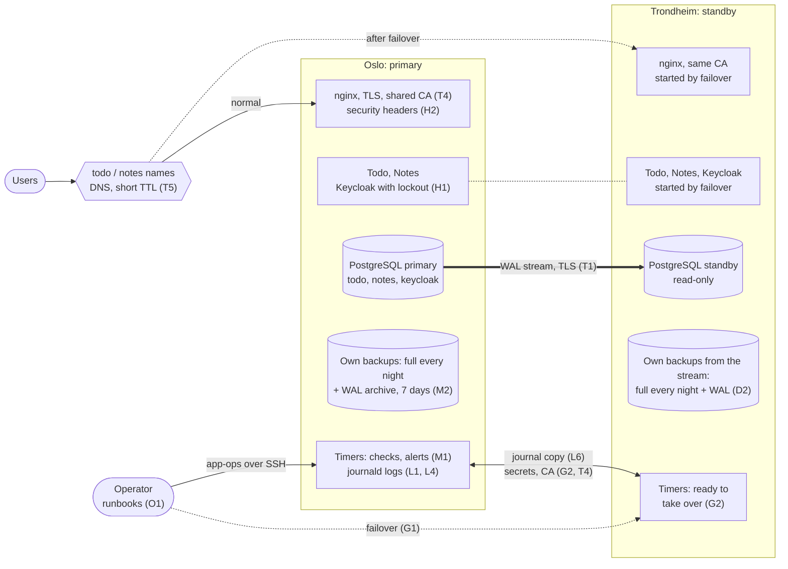
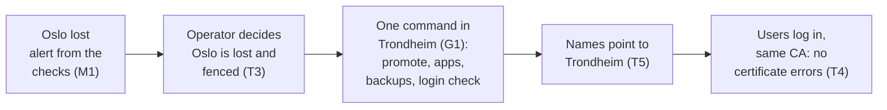

# Target picture: Oslo and Trondheim after the backlog

One page showing how the solution works once [BACKLOG.md](BACKLOG.md) is done.
Codes in brackets are backlog items. Two machines on separate hardware at
separate sites, and no third machine.

## Every day

## When Oslo burns: running in Trondheim within 30 minutes

Failover never starts by itself: with only two sites, Trondheim cannot tell a
fire from a broken link, and promoting on a broken link gives two primaries
(split-brain). So there is one human decision, then one command. The disaster
drill in the Proxmox lab times the whole chain and requires under 30 minutes
(G3, G4). The last seconds of writes before the fire can be lost (asynchronous
replication, C4, T2).

Afterwards: a new Oslo machine becomes Trondheim's standby (G5), and a planned
switchover with no data loss moves operation back (T6).

## What the solution is made of

| Area | After the backlog |
|---|---|
| On the hosts | Only Python's standard library, systemd, journald, Podman and PostgreSQL. No new services. |
| Tools | `install.sh` for one host, app-ops over plain SSH for the pair: failover (G1), updates (U1), switchover (T6). Ansible is retired. |
| Between the sites | Replication encrypted (T1); one CA (T4); DR secrets synchronised (G2). |
| Backups | Each host backs up its own copy: a full backup every night and the WAL archive, 7 days, so PITR works even if one site is lost (D2, M2). |
| Security | Keycloak lockout (H1), HTTP headers (H2), fapolicyd trusts only root-owned files (F), tool-owned firewall rules (W). |
| Logs | Every tool command in journald with time, host and result (L1, L2), kept across reboots (L4), copied to the other site (L6), one page on where to look (L5). |
| Warnings | Timers turn replication, slot, archive, disk and certificate problems into failed units and optional mail (M1, U2). |
| Proof | Acceptance with content fingerprints for all three databases (C1-C3), plus the timed disaster drill (G3, G4). |
| Size | Less code than today, new features included. |
